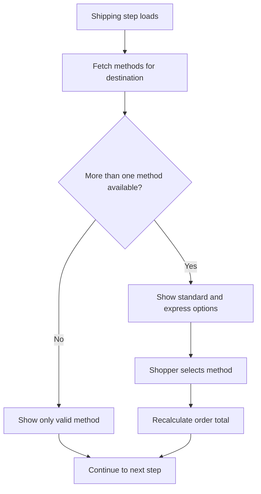

# User Story: Select Shipping Method

**Story ID:** US-002
**Epic/Feature:** Checkout Experience
**Priority:** High
**Story Points:** 2
**Status:** Proposed

---

## User Story

**As a** shopper
**I want** to choose between available shipping methods
**So that** I can balance delivery speed and cost

---

## Context
This story adds the decision point where the shopper chooses how the order will be delivered. It matters because shipping speed and availability affect both customer expectation and fulfillment flow.

---

## Functional / Business References
- examples/input-checkout-requirements.md: source requirement narrative for Select Shipping Method

## Acceptance Criteria

### Scenario 1: View available methods
**Given** a shopper has entered a valid shipping address
**When** they reach the shipping method step
**Then** the system shows the available shipping methods for that destination

### Scenario 2: Select express shipping
**Given** standard and express shipping are available
**When** the shopper selects express shipping
**Then** the order total updates to reflect the express shipping cost

### Scenario 3: Method unavailable
**Given** only one shipping method is available for the destination
**When** the shopper reaches the shipping method step
**Then** unavailable methods are not selectable

---

## Business Rules
- Shipping options must reflect the destination country.

## Scope Notes
- This story focuses on method selection and cost recalculation.
- Carrier-rate retrieval is treated as an existing dependency.

## Dependencies
- Requires a valid shipping address and a shipping-rate service response.

## Non-Functional Notes
- Shipping options should load quickly enough to avoid interrupting checkout flow.

## Testing Notes
- Validate destination-based availability, cost recalculation, and unavailable-method handling.

## Diagrams
### Diagram 1: Shipping method selection decision flow
**Type:** Mermaid Flowchart
**Why this is useful:** It shows how address context, method availability, and price recalculation interact before the shopper can continue checkout.

**Explanation:** This diagram highlights the two core outcomes in the story: destination-based availability and checkout-total updates after a valid selection.

## Open Questions
N/A

## Source Traceability
- examples/input-checkout-requirements.md

## Implementation Notes
N/A
