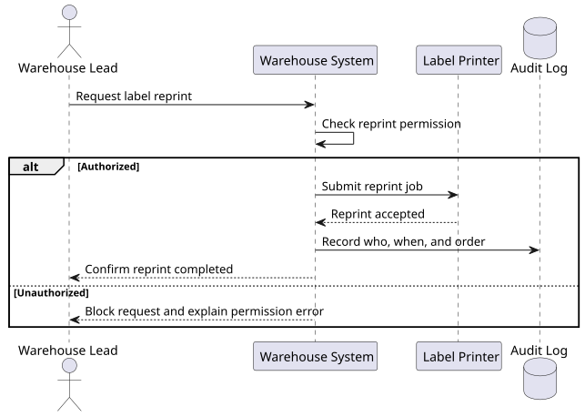

# User Story: Reprint Label With Audit Log

**Story ID:** US-021
**Epic/Feature:** Warehouse Operations
**Priority:** High
**Story Points:** 5
**Status:** Proposed

---

## User Story

**As a** warehouse lead
**I want** to reprint a failed shipping label with audit tracking
**So that** shipment recovery actions remain traceable

---

## Context
This story adds the ability to reprint a failed label while preserving who triggered the recovery action. It matters because warehouse teams need both operational continuity and auditability when label generation fails.

---

## Functional / Business References
- examples/input-warehouse-operations.md: source requirement narrative for Reprint Label With Audit Log

## Acceptance Criteria

### Scenario 1: Reprint failed label
**Given** a shipment label failed during the first print attempt
**When** an authorized warehouse lead requests a reprint
**Then** the system issues a new print job for the same order

### Scenario 2: Audit event recorded
**Given** an authorized reprint request succeeds
**When** the reprint action completes
**Then** the system records who reprinted the label, when they did it, and for which order

### Scenario 3: Unauthorized reprint attempt
**Given** a user without reprint permission attempts to reprint a label
**When** they submit the reprint request
**Then** the system blocks the action and does not create an audit event that implies success

---

## Business Rules
- Reprints must remain attributable to an authorized user.

## Scope Notes
- This story covers reprint behavior and audit capture, not first-time printing.

## Dependencies
- Depends on label-printing capability and audit-log storage.

## Non-Functional Notes
- Audit data must be retained in a way that supports operational investigation.

## Testing Notes
- Validate successful reprints, unauthorized attempts, and audit-record completeness.

## Diagrams
### Diagram 1: Reprint with audit capture sequence
**Type:** PlantUML Sequence Diagram
**Why this is useful:** It makes the audit requirement concrete by showing that successful reprints must produce both a print action and an audit event.

**Source:** [us-021-reprint-audit-sequence.puml](../_diagram-sources/us-021-reprint-audit-sequence.puml)
**Explanation:** This sequence shows that audit capture is part of the successful reprint path, while unauthorized attempts are blocked before any audit record could imply a successful reprint.

## Open Questions
- Confirm the required retention period for audit events.

## Source Traceability
- examples/input-warehouse-operations.md

## Implementation Notes
- Observability for reprint failures is important because warehouse operations are time-sensitive.
