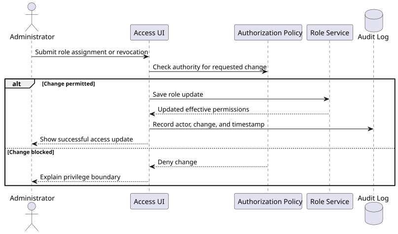

# User Story: Assign and Revoke Roles

**Story ID:** US-031
**Epic/Feature:** Role Access Management
**Priority:** Critical
**Story Points:** 5
**Status:** Proposed

---

## User Story

**As a** system administrator
**I want** to assign and revoke roles for a user account
**So that** access can be updated safely and appropriately

---

## Context
This story adds the capability to grant or remove roles from a user. It matters because access control needs to stay aligned with changing responsibilities while remaining governable.

---

## Functional / Business References
- examples/input-role-access-management.md: source requirement narrative for Assign and Revoke Roles

## Acceptance Criteria

### Scenario 1: Assign permitted role
**Given** an administrator is allowed to manage user access
**When** they assign a permitted role to a user
**Then** the new role is saved and reflected in the user's effective permissions

### Scenario 2: Prevent privilege escalation
**Given** an administrator attempts to assign a role beyond their own authority
**When** they submit the change
**Then** the system blocks the action and explains that the role change is not permitted

### Scenario 3: Audit access change
**Given** a role assignment or revocation succeeds
**When** the change is saved
**Then** the system records who made the change, what changed, and when it occurred

---

## Business Rules
- Access changes must respect role-management authority boundaries.

## Scope Notes
- This story covers assignment and revocation workflows, including audit recording.

## Dependencies
- Requires current-role visibility, authorization policy checks, and audit-log persistence.

## Non-Functional Notes
- Role changes should preserve security and accountability expectations.

## Testing Notes
- Validate allowed changes, blocked privilege escalation, and audit-log completeness.

## Diagrams
### Diagram 1: Role change and audit sequence
**Type:** PlantUML Sequence Diagram
**Why this is useful:** It shows the authorization boundary around role changes and the audit step that must occur after a successful assignment or revocation.

**Source:** [us-031-role-change-audit-sequence.puml](../_diagram-sources/us-031-role-change-audit-sequence.puml)
**Explanation:** The diagram emphasizes that permission checks happen before the write, and that a successful write is incomplete until the audit event is captured.

## Open Questions
- Confirm whether dual approval is required for sensitive roles.

## Source Traceability
- examples/input-role-access-management.md

## Implementation Notes
- Infrastructure and backend controls are relevant, but the story remains tool-agnostic.
